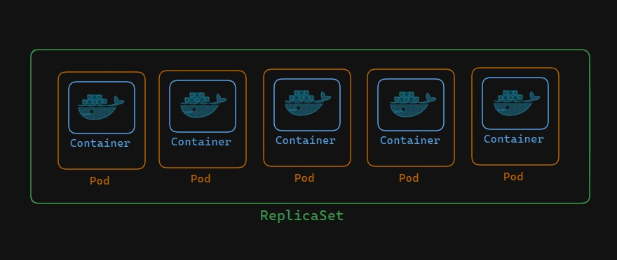
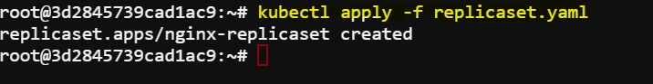
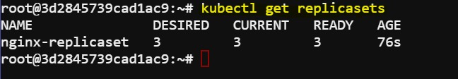
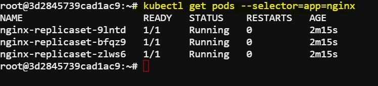
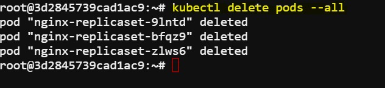
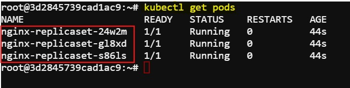

# ReplicaSet Deployment: Managing NGINX Pods in Kubernetes

A ReplicaSet in Kubernetes manages multiple identical pod replicas to ensure a specified number of replicas are always running.



## Task

We will create a ReplicaSet with the following configuration:
- name: `nginx-replicaset`
- image: `nginx:latest`
- replicas: `3`


## Creating the ReplicaSet

We will use `vim` editor. To install `vim` use this: 

```
sudo apt update
sudo apt install vim
```

After successful installation of vim create the manifest file ``vim replicaset.yaml``

```yaml
apiVersion: apps/v1
kind: ReplicaSet
metadata:
  name: nginx-replicaset
spec:
  replicas: 3
  selector:
    matchLabels:
      app: nginx
  template:
    metadata:
      labels:
        app: nginx
    spec:
      containers:
      - name: nginx
        image: nginx:latest
        ports:
        - containerPort: 80
```
Press ``ESC`` then type `:wq` then press `Enter` to save and exit from vim

Apply the YAML manifest using the `kubectl apply` command.

```
kubectl apply -f replicaset.yaml
```
This will create the ReplicaSet and deploy 3 nginx pods.

Expected output: 



## Verify Replicasets and Pods 

Once the ReplicaSet is deployed, we can manage it using kubectl commands.ReplicaSet ensures the the number of pods with labels `nginx` is always 3.If any of the pods were accidently destroyed or deleted,it will automatically generate the pod by using the template provided in definition file.

To view the replicasets and pods managed by replicset use this commands

```
kubectl get replicasets 
kubectl get pods  --selector=app=nginx
```
If the pods were successfully generated we will see something like this:





## Delete the pods to check the regeneration (Optional)

Now if we delete any of the pods ,we will see within a second it will generate a new pod and the total number of pods will be remain same as 3.

```bash
kubectl delete pods --all
```

Expected output:



Now if we check the pods we will see that the pods are regenerated by the replicaset:

```bash
kubectl get pods
```

Expected output:

